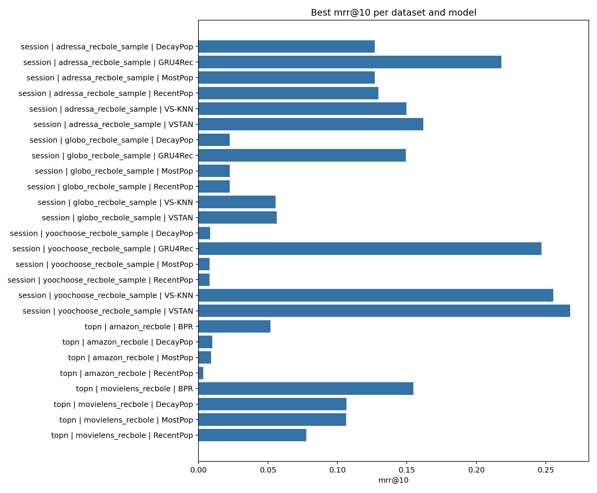
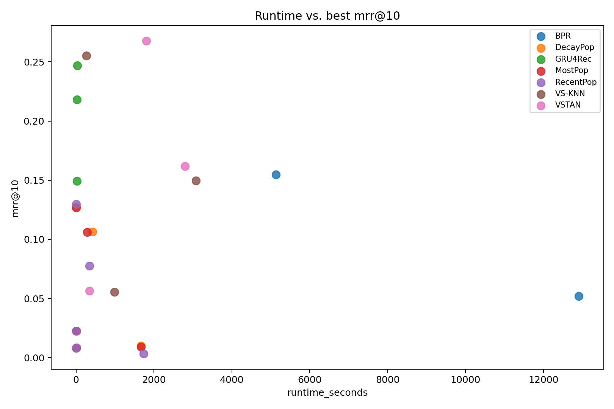
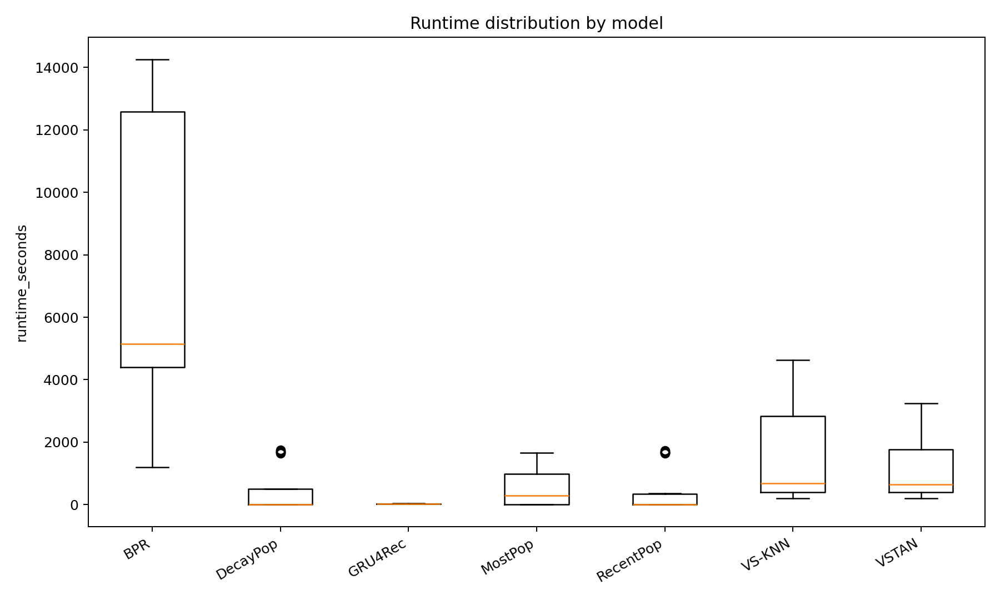

# Structured RecBole Evaluation

This report summarizes the available RecBole tuning results for Top-N and session-based recommendation experiments.

## Scope

- Result rows: 356
- Successful rows: 355
- Datasets: adressa_recbole_sample, amazon_recbole, globo_recbole_sample, movielens_recbole, yoochoose_recbole_sample
- Models: BPR, DecayPop, GRU4Rec, MostPop, RecentPop, VS-KNN, VSTAN
- Primary ranking metric: `mrr@10`

## Recommended Reading of Metrics

- `MRR@10` is the main quality metric here because it rewards models that place the first relevant item very high. This is especially important for session recommendation.
- `NDCG@10` is the best supporting ranking metric because it rewards multiple relevant hits while still valuing top positions more.
- `Hit@10` is useful as an intuitive recall-style metric, but it does not distinguish rank 1 from rank 10.
- `Coverage@10` and `avg_recommendation_popularity@10` are important for the thesis question around popularity bias. High accuracy with very low coverage can mean the model recommends a narrow popular item set.
- `runtime_seconds`, runtime shares, and `mrr@10_per_minute` show whether a quality gain is computationally worth it.
- `quality_runtime_pareto_efficient` marks configurations that are not dominated by another configuration with both better/equal MRR@10 and lower/equal runtime.

## Dataset Characteristics

| dataset                  | inter_file_found   |   interactions |   users_or_sessions |   items |   avg_interactions_per_user_or_session |   avg_interactions_per_item |   interaction_matrix_density | timestamp_min             | timestamp_max             |
|:-------------------------|:-------------------|---------------:|--------------------:|--------:|---------------------------------------:|----------------------------:|-----------------------------:|:--------------------------|:--------------------------|
| adressa_recbole_sample   | True               |         500000 |              166009 |    4122 |                                3.01188 |                    121.3    |                  0.000730685 | 2016-12-31T23:00:02+00:00 | 2017-01-02T09:04:50+00:00 |
| amazon_recbole           | True               |        2626862 |              768903 |  116200 |                                3.41638 |                     22.6064 |                  2.94008e-05 | 1999-03-17T19:55:11+00:00 | 2023-09-12T00:38:00+00:00 |
| globo_recbole_sample     | True               |         499999 |              175715 |   18882 |                                2.84551 |                     26.4802 |                  0.0001507   | 2017-10-01T03:00:28+00:00 | 2017-10-31T21:31:02+00:00 |
| movielens_recbole        | True               |       20000263 |              138493 |   26744 |                              144.414   |                    747.841  |                  0.00539985  | 1995-01-09T11:46:44+00:00 | 2015-03-31T06:40:02+00:00 |
| yoochoose_recbole_sample | True               |         499998 |              126496 |   22219 |                                3.95268 |                     22.5032 |                  0.000177896 | 2014-04-01T03:00:25+00:00 | 2014-09-30T02:19:29+00:00 |

## Models and Run Counts

| experiment_type   | dataset                  | model     | model_family                    |   runs |   successful_runs |   failed_runs |
|:------------------|:-------------------------|:----------|:--------------------------------|-------:|------------------:|--------------:|
| session           | adressa_recbole_sample   | GRU4Rec   | neural session model            |     36 |                36 |             0 |
| session           | adressa_recbole_sample   | VS-KNN    | session neighborhood            |      9 |                 9 |             0 |
| session           | adressa_recbole_sample   | VSTAN     | time-aware session neighborhood |     54 |                54 |             0 |
| session           | globo_recbole_sample     | GRU4Rec   | neural session model            |     36 |                36 |             0 |
| session           | globo_recbole_sample     | VS-KNN    | session neighborhood            |      9 |                 9 |             0 |
| session           | globo_recbole_sample     | VSTAN     | time-aware session neighborhood |     55 |                54 |             1 |
| session           | yoochoose_recbole_sample | GRU4Rec   | neural session model            |     36 |                36 |             0 |
| session           | yoochoose_recbole_sample | VS-KNN    | session neighborhood            |      9 |                 9 |             0 |
| session           | yoochoose_recbole_sample | VSTAN     | time-aware session neighborhood |     54 |                54 |             0 |
| topn              | amazon_recbole           | BPR       | latent factor baseline          |     10 |                10 |             0 |
| topn              | amazon_recbole           | DecayPop  | time-aware popularity           |      8 |                 8 |             0 |
| topn              | amazon_recbole           | MostPop   | popularity baseline             |      2 |                 2 |             0 |
| topn              | amazon_recbole           | RecentPop | time-aware popularity           |      9 |                 9 |             0 |
| topn              | movielens_recbole        | BPR       | latent factor baseline          |     10 |                10 |             0 |
| topn              | movielens_recbole        | DecayPop  | time-aware popularity           |      8 |                 8 |             0 |
| topn              | movielens_recbole        | MostPop   | popularity baseline             |      2 |                 2 |             0 |
| topn              | movielens_recbole        | RecentPop | time-aware popularity           |      9 |                 9 |             0 |

## Tuning Search Space

| experiment_type   | dataset                  | model     |   runs |   unique_configurations | learning_rate         | hidden_size         | dropout_prob   |   num_layers | loss_type   | vsknn_k             | vsknn_sample_size   | vstan_k             | vstan_sample_size   | vstan_position_decay   | vstan_idf_weighting   | embedding_size    | train_neg_sample_args                                                                            | decay_lambda                                    | window_days                                  |
|:------------------|:-------------------------|:----------|-------:|------------------------:|:----------------------|:--------------------|:---------------|-------------:|:------------|:--------------------|:--------------------|:--------------------|:--------------------|:-----------------------|:----------------------|:------------------|:-------------------------------------------------------------------------------------------------|:------------------------------------------------|:---------------------------------------------|
| session           | adressa_recbole_sample   | GRU4Rec   |     36 |                      36 | 0.0001, 0.0005, 0.001 | 100.0, 128.0, 256.0 | 0.1, 0.2       |            1 | CE          | nan                 | nan                 | nan                 | nan                 | nan                    | nan                   | nan               | nan                                                                                              | nan                                             | nan                                          |
| session           | adressa_recbole_sample   | VS-KNN    |      9 |                       9 | nan                   | nan                 | nan            |          nan | nan         | 100.0, 200.0, 500.0 | 100.0, 250.0, 500.0 | nan                 | nan                 | nan                    | nan                   | nan               | nan                                                                                              | nan                                             | nan                                          |
| session           | adressa_recbole_sample   | VSTAN     |     54 |                      54 | nan                   | nan                 | nan            |          nan | nan         | nan                 | nan                 | 100.0, 200.0, 500.0 | 100.0, 250.0, 500.0 | 0.05, 0.1, 0.2         | False, True           | nan               | nan                                                                                              | nan                                             | nan                                          |
| session           | globo_recbole_sample     | GRU4Rec   |     36 |                      36 | 0.0001, 0.0005, 0.001 | 100.0, 128.0, 256.0 | 0.1, 0.2       |            1 | CE          | nan                 | nan                 | nan                 | nan                 | nan                    | nan                   | nan               | nan                                                                                              | nan                                             | nan                                          |
| session           | globo_recbole_sample     | VS-KNN    |      9 |                       9 | nan                   | nan                 | nan            |          nan | nan         | 100.0, 200.0, 500.0 | 100.0, 250.0, 500.0 | nan                 | nan                 | nan                    | nan                   | nan               | nan                                                                                              | nan                                             | nan                                          |
| session           | globo_recbole_sample     | VSTAN     |     55 |                      55 | nan                   | nan                 | nan            |          nan | nan         | nan                 | nan                 | 100.0, 200.0, 500.0 | 100.0, 250.0, 500.0 | 0.05, 0.1, 0.2         | False, True           | nan               | nan                                                                                              | nan                                             | nan                                          |
| session           | yoochoose_recbole_sample | GRU4Rec   |     36 |                      36 | 0.0001, 0.0005, 0.001 | 100.0, 128.0, 256.0 | 0.1, 0.2       |            1 | CE          | nan                 | nan                 | nan                 | nan                 | nan                    | nan                   | nan               | nan                                                                                              | nan                                             | nan                                          |
| session           | yoochoose_recbole_sample | VS-KNN    |      9 |                       9 | nan                   | nan                 | nan            |          nan | nan         | 100.0, 200.0, 500.0 | 100.0, 250.0, 500.0 | nan                 | nan                 | nan                    | nan                   | nan               | nan                                                                                              | nan                                             | nan                                          |
| session           | yoochoose_recbole_sample | VSTAN     |     54 |                      54 | nan                   | nan                 | nan            |          nan | nan         | nan                 | nan                 | 100.0, 200.0, 500.0 | 100.0, 250.0, 500.0 | 0.05, 0.1, 0.2         | False, True           | nan               | nan                                                                                              | nan                                             | nan                                          |
| topn              | amazon_recbole           | BPR       |     10 |                      10 | 0.0001, 0.0005, 0.001 | nan                 | nan            |          nan | nan         | nan                 | nan                 | nan                 | nan                 | nan                    | nan                   | 128.0, 32.0, 64.0 | {'distribution': 'uniform', 'sample_num': 1, 'alpha': 1.0, 'dynamic': False, 'candidate_num': 0} | nan                                             | nan                                          |
| topn              | amazon_recbole           | DecayPop  |      8 |                       7 | nan                   | nan                 | nan            |          nan | nan         | nan                 | nan                 | nan                 | nan                 | nan                    | nan                   | nan               | nan                                                                                              | 1e-06, 1e-07, 1e-08, 1e-09, 5e-07, 5e-08, 5e-09 | nan                                          |
| topn              | amazon_recbole           | MostPop   |      2 |                       1 | nan                   | nan                 | nan            |          nan | nan         | nan                 | nan                 | nan                 | nan                 | nan                    | nan                   | nan               | nan                                                                                              | nan                                             | nan                                          |
| topn              | amazon_recbole           | RecentPop |      9 |                       8 | nan                   | nan                 | nan            |          nan | nan         | nan                 | nan                 | nan                 | nan                 | nan                    | nan                   | nan               | nan                                                                                              | nan                                             | 1.0, 14.0, 180.0, 3.0, 30.0, 60.0, 7.0, 90.0 |
| topn              | movielens_recbole        | BPR       |     10 |                      10 | 0.0001, 0.0005, 0.001 | nan                 | nan            |          nan | nan         | nan                 | nan                 | nan                 | nan                 | nan                    | nan                   | 128.0, 32.0, 64.0 | {'distribution': 'uniform', 'sample_num': 1, 'alpha': 1.0, 'dynamic': False, 'candidate_num': 0} | nan                                             | nan                                          |
| topn              | movielens_recbole        | DecayPop  |      8 |                       7 | nan                   | nan                 | nan            |          nan | nan         | nan                 | nan                 | nan                 | nan                 | nan                    | nan                   | nan               | nan                                                                                              | 1e-06, 1e-07, 1e-08, 1e-09, 5e-07, 5e-08, 5e-09 | nan                                          |
| topn              | movielens_recbole        | MostPop   |      2 |                       1 | nan                   | nan                 | nan            |          nan | nan         | nan                 | nan                 | nan                 | nan                 | nan                    | nan                   | nan               | nan                                                                                              | nan                                             | nan                                          |
| topn              | movielens_recbole        | RecentPop |      9 |                       8 | nan                   | nan                 | nan            |          nan | nan         | nan                 | nan                 | nan                 | nan                 | nan                    | nan                   | nan               | nan                                                                                              | nan                                             | 1.0, 14.0, 180.0, 3.0, 30.0, 60.0, 7.0, 90.0 |

## Best Results Overall

| experiment_type   | dataset                  | model   | device   |   epochs |   train_batch_size |   eval_batch_size | status   |   hit@5 |   hit@10 |   ndcg@5 |   ndcg@10 |   mrr@5 |   mrr@10 |   coverage@10 |   avg_recommendation_popularity@10 |   runtime_seconds |   train_runtime_seconds |   eval_runtime_seconds |   extra_metrics_runtime_seconds |   runtime_minutes |   train_runtime_share |   eval_runtime_share |   extra_metrics_runtime_share |   mrr@10_per_minute |   ndcg@10_per_minute |   hit@10_per_minute |   rank_by_mrr@10 |   relative_mrr@10_to_dataset_best |   mrr@10_gap_to_dataset_best |   runtime_relative_to_dataset_fastest | quality_runtime_pareto_efficient   |   vsknn_k |   vsknn_sample_size | run_id                                                                                                                                 |   error_message | config_json                                                                                           |   vstan_k |   vstan_sample_size |   vstan_position_decay | vstan_idf_weighting   |   hidden_size |   learning_rate |   dropout_prob |   num_layers |   loss_type |   train_neg_sample_args | experiment_name   | source_file                                                                                                       | has_experiment_log   |   logged_at |   window_days |   decay_lambda |   embedding_size |
|:------------------|:-------------------------|:--------|:---------|---------:|-------------------:|------------------:|:---------|--------:|---------:|---------:|----------:|--------:|---------:|--------------:|-----------------------------------:|------------------:|------------------------:|-----------------------:|--------------------------------:|------------------:|----------------------:|---------------------:|------------------------------:|--------------------:|---------------------:|--------------------:|-----------------:|----------------------------------:|-----------------------------:|--------------------------------------:|:-----------------------------------|----------:|--------------------:|:---------------------------------------------------------------------------------------------------------------------------------------|----------------:|:------------------------------------------------------------------------------------------------------|----------:|--------------------:|-----------------------:|:----------------------|--------------:|----------------:|---------------:|-------------:|------------:|------------------------:|:------------------|:------------------------------------------------------------------------------------------------------------------|:---------------------|------------:|--------------:|---------------:|-----------------:|
| session           | yoochoose_recbole_sample | VSTAN   | cuda     |        1 |               2048 |              1024 | success  |  0.4277 |   0.5334 |   0.304  |    0.3384 |  0.263  |   0.2773 |           nan |                                nan |            541.25 |                  213.93 |                 319.72 |                               0 |           9.02083 |              0.395252 |             0.590707 |                             0 |          0.03074    |            0.0375132 |           0.0591298 |                1 |                          1        |                       0      |                               31.0172 | True                               |       nan |                 nan | yoochoose_recbole_sample::VSTAN::{"vstan_idf_weighting": true, "vstan_k": 200, "vstan_position_decay": 0.2, "vstan_sample_size": 500}  |             nan | {"vstan_idf_weighting": true, "vstan_k": 200, "vstan_position_decay": 0.2, "vstan_sample_size": 500}  |       200 |                 500 |                    0.2 | True                  |           nan |             nan |            nan |          nan |         nan |                     nan | session           | F:\TimeAware Popularity Models and Fair Evaluation\recbole_results\tuning_results\session_full_tuning_results.csv | True                 |         nan |           nan |            nan |              nan |
| session           | yoochoose_recbole_sample | VSTAN   | cuda     |        1 |               2048 |              1024 | success  |  0.4236 |   0.5276 |   0.3026 |    0.3364 |  0.2626 |   0.2766 |           nan |                                nan |           1645.69 |                  652.31 |                 985.92 |                               0 |          27.4282  |              0.396375 |             0.599092 |                             0 |          0.0100845  |            0.0122648 |           0.0192357 |                2 |                          0.997476 |                       0.0007 |                               94.3089 | False                              |       nan |                 nan | yoochoose_recbole_sample::VSTAN::{"vstan_idf_weighting": true, "vstan_k": 500, "vstan_position_decay": 0.2, "vstan_sample_size": 500}  |             nan | {"vstan_idf_weighting": true, "vstan_k": 500, "vstan_position_decay": 0.2, "vstan_sample_size": 500}  |       500 |                 500 |                    0.2 | True                  |           nan |             nan |            nan |          nan |         nan |                     nan | session           | F:\TimeAware Popularity Models and Fair Evaluation\recbole_results\tuning_results\session_full_tuning_results.csv | True                 |         nan |           nan |            nan |              nan |
| session           | yoochoose_recbole_sample | VSTAN   | cuda     |        1 |               2048 |              1024 | success  |  0.427  |   0.5276 |   0.3035 |    0.3362 |  0.2626 |   0.2762 |           nan |                                nan |            308.06 |                  120.77 |                 179.36 |                               0 |           5.13433 |              0.392034 |             0.582224 |                             0 |          0.0537947  |            0.0654808 |           0.102759  |                3 |                          0.996033 |                       0.0011 |                               17.6539 | True                               |       nan |                 nan | yoochoose_recbole_sample::VSTAN::{"vstan_idf_weighting": true, "vstan_k": 100, "vstan_position_decay": 0.2, "vstan_sample_size": 500}  |             nan | {"vstan_idf_weighting": true, "vstan_k": 100, "vstan_position_decay": 0.2, "vstan_sample_size": 500}  |       100 |                 500 |                    0.2 | True                  |           nan |             nan |            nan |          nan |         nan |                     nan | session           | F:\TimeAware Popularity Models and Fair Evaluation\recbole_results\tuning_results\session_full_tuning_results.csv | True                 |         nan |           nan |            nan |              nan |
| session           | yoochoose_recbole_sample | VSTAN   | cuda     |        1 |               2048 |              1024 | success  |  0.4218 |   0.5247 |   0.3015 |    0.3349 |  0.2616 |   0.2756 |           nan |                                nan |            644.01 |                  253.7  |                 382.91 |                               0 |          10.7335  |              0.393938 |             0.594572 |                             0 |          0.0256766  |            0.0312014 |           0.0488843 |                4 |                          0.993869 |                       0.0017 |                               36.906  | False                              |       nan |                 nan | yoochoose_recbole_sample::VSTAN::{"vstan_idf_weighting": true, "vstan_k": 200, "vstan_position_decay": 0.2, "vstan_sample_size": 250}  |             nan | {"vstan_idf_weighting": true, "vstan_k": 200, "vstan_position_decay": 0.2, "vstan_sample_size": 250}  |       200 |                 250 |                    0.2 | True                  |           nan |             nan |            nan |          nan |         nan |                     nan | session           | F:\TimeAware Popularity Models and Fair Evaluation\recbole_results\tuning_results\session_full_tuning_results.csv | True                 |         nan |           nan |            nan |              nan |
| session           | yoochoose_recbole_sample | VSTAN   | cuda     |        1 |               2048 |              1024 | success  |  0.4213 |   0.5239 |   0.3015 |    0.3348 |  0.2618 |   0.2756 |           nan |                                nan |            961.42 |                  377.66 |                 576.14 |                               0 |          16.0237  |              0.392815 |             0.599259 |                             0 |          0.0171996  |            0.0208941 |           0.0326954 |                4 |                          0.993869 |                       0.0017 |                               55.0957 | False                              |       nan |                 nan | yoochoose_recbole_sample::VSTAN::{"vstan_idf_weighting": true, "vstan_k": 500, "vstan_position_decay": 0.2, "vstan_sample_size": 250}  |             nan | {"vstan_idf_weighting": true, "vstan_k": 500, "vstan_position_decay": 0.2, "vstan_sample_size": 250}  |       500 |                 250 |                    0.2 | True                  |           nan |             nan |            nan |          nan |         nan |                     nan | session           | F:\TimeAware Popularity Models and Fair Evaluation\recbole_results\tuning_results\session_full_tuning_results.csv | True                 |         nan |           nan |            nan |              nan |
| session           | yoochoose_recbole_sample | VSTAN   | cuda     |        1 |               2048 |              1024 | success  |  0.4247 |   0.5252 |   0.3024 |    0.3351 |  0.2619 |   0.2755 |           nan |                                nan |            305.48 |                  119.65 |                 178.03 |                               0 |           5.09133 |              0.391679 |             0.582788 |                             0 |          0.0541116  |            0.0658177 |           0.103156  |                6 |                          0.993509 |                       0.0018 |                               17.506  | True                               |       nan |                 nan | yoochoose_recbole_sample::VSTAN::{"vstan_idf_weighting": true, "vstan_k": 100, "vstan_position_decay": 0.2, "vstan_sample_size": 250}  |             nan | {"vstan_idf_weighting": true, "vstan_k": 100, "vstan_position_decay": 0.2, "vstan_sample_size": 250}  |       100 |                 250 |                    0.2 | True                  |           nan |             nan |            nan |          nan |         nan |                     nan | session           | F:\TimeAware Popularity Models and Fair Evaluation\recbole_results\tuning_results\session_full_tuning_results.csv | True                 |         nan |           nan |            nan |              nan |
| session           | yoochoose_recbole_sample | VSTAN   | cuda     |        1 |               2048 |              1024 | success  |  0.4197 |   0.5251 |   0.2997 |    0.334  |  0.26   |   0.2743 |           nan |                                nan |            526.53 |                  208.3  |                 310.77 |                               0 |           8.7755  |              0.395609 |             0.590223 |                             0 |          0.0312575  |            0.0380605 |           0.059837  |                7 |                          0.989181 |                       0.003  |                               30.1736 | False                              |       nan |                 nan | yoochoose_recbole_sample::VSTAN::{"vstan_idf_weighting": false, "vstan_k": 200, "vstan_position_decay": 0.2, "vstan_sample_size": 500} |             nan | {"vstan_idf_weighting": false, "vstan_k": 200, "vstan_position_decay": 0.2, "vstan_sample_size": 500} |       200 |                 500 |                    0.2 | False                 |           nan |             nan |            nan |          nan |         nan |                     nan | session           | F:\TimeAware Popularity Models and Fair Evaluation\recbole_results\tuning_results\session_full_tuning_results.csv | True                 |         nan |           nan |            nan |              nan |
| session           | yoochoose_recbole_sample | VSTAN   | cuda     |        1 |               2048 |              1024 | success  |  0.4204 |   0.521  |   0.3001 |    0.3329 |  0.2603 |   0.274  |           nan |                                nan |            296.72 |                  116.25 |                 172.58 |                               0 |           4.94533 |              0.391783 |             0.581626 |                             0 |          0.0554058  |            0.067316  |           0.105352  |                8 |                          0.9881   |                       0.0033 |                               17.004  | True                               |       nan |                 nan | yoochoose_recbole_sample::VSTAN::{"vstan_idf_weighting": false, "vstan_k": 100, "vstan_position_decay": 0.2, "vstan_sample_size": 500} |             nan | {"vstan_idf_weighting": false, "vstan_k": 100, "vstan_position_decay": 0.2, "vstan_sample_size": 500} |       100 |                 500 |                    0.2 | False                 |           nan |             nan |            nan |          nan |         nan |                     nan | session           | F:\TimeAware Popularity Models and Fair Evaluation\recbole_results\tuning_results\session_full_tuning_results.csv | True                 |         nan |           nan |            nan |              nan |
| session           | yoochoose_recbole_sample | VSTAN   | cuda     |        1 |               2048 |              1024 | success  |  0.4166 |   0.5196 |   0.2985 |    0.3319 |  0.2594 |   0.2733 |           nan |                                nan |           1626.95 |                  644.75 |                 974.74 |                               0 |          27.1158  |              0.396294 |             0.599121 |                             0 |          0.010079   |            0.0122401 |           0.0191622 |                9 |                          0.985575 |                       0.004  |                               93.235  | False                              |       nan |                 nan | yoochoose_recbole_sample::VSTAN::{"vstan_idf_weighting": false, "vstan_k": 500, "vstan_position_decay": 0.2, "vstan_sample_size": 500} |             nan | {"vstan_idf_weighting": false, "vstan_k": 500, "vstan_position_decay": 0.2, "vstan_sample_size": 500} |       500 |                 500 |                    0.2 | False                 |           nan |             nan |            nan |          nan |         nan |                     nan | session           | F:\TimeAware Popularity Models and Fair Evaluation\recbole_results\tuning_results\session_full_tuning_results.csv | True                 |         nan |           nan |            nan |              nan |
| session           | yoochoose_recbole_sample | VSTAN   | cuda     |        1 |               2048 |              1024 | success  |  0.4172 |   0.5178 |   0.2983 |    0.3311 |  0.259  |   0.2726 |           nan |                                nan |            297.47 |                  116.82 |                 172.92 |                               0 |           4.95783 |              0.392712 |             0.581302 |                             0 |          0.0549837  |            0.0667832 |           0.104441  |               10 |                          0.983051 |                       0.0047 |                               17.047  | False                              |       nan |                 nan | yoochoose_recbole_sample::VSTAN::{"vstan_idf_weighting": false, "vstan_k": 100, "vstan_position_decay": 0.2, "vstan_sample_size": 250} |             nan | {"vstan_idf_weighting": false, "vstan_k": 100, "vstan_position_decay": 0.2, "vstan_sample_size": 250} |       100 |                 250 |                    0.2 | False                 |           nan |             nan |            nan |          nan |         nan |                     nan | session           | F:\TimeAware Popularity Models and Fair Evaluation\recbole_results\tuning_results\session_full_tuning_results.csv | True                 |         nan |           nan |            nan |              nan |
| session           | yoochoose_recbole_sample | VSTAN   | cuda     |        1 |               2048 |              1024 | success  |  0.4146 |   0.5156 |   0.2976 |    0.3304 |  0.2589 |   0.2725 |           nan |                                nan |            941.71 |                  367.83 |                 566.27 |                               0 |          15.6952  |              0.390598 |             0.601321 |                             0 |          0.017362   |            0.0210511 |           0.0328509 |               11 |                          0.98269  |                       0.0048 |                               53.9662 | False                              |       nan |                 nan | yoochoose_recbole_sample::VSTAN::{"vstan_idf_weighting": false, "vstan_k": 500, "vstan_position_decay": 0.2, "vstan_sample_size": 250} |             nan | {"vstan_idf_weighting": false, "vstan_k": 500, "vstan_position_decay": 0.2, "vstan_sample_size": 250} |       500 |                 250 |                    0.2 | False                 |           nan |             nan |            nan |          nan |         nan |                     nan | session           | F:\TimeAware Popularity Models and Fair Evaluation\recbole_results\tuning_results\session_full_tuning_results.csv | True                 |         nan |           nan |            nan |              nan |
| session           | yoochoose_recbole_sample | VSTAN   | cuda     |        1 |               2048 |              1024 | success  |  0.4148 |   0.5164 |   0.2976 |    0.3306 |  0.2587 |   0.2725 |           nan |                                nan |            635.72 |                  250.32 |                 378    |                               0 |          10.5953  |              0.393758 |             0.594601 |                             0 |          0.0257189  |            0.0312024 |           0.0487384 |               11 |                          0.98269  |                       0.0048 |                               36.4309 | False                              |       nan |                 nan | yoochoose_recbole_sample::VSTAN::{"vstan_idf_weighting": false, "vstan_k": 200, "vstan_position_decay": 0.2, "vstan_sample_size": 250} |             nan | {"vstan_idf_weighting": false, "vstan_k": 200, "vstan_position_decay": 0.2, "vstan_sample_size": 250} |       200 |                 250 |                    0.2 | False                 |           nan |             nan |            nan |          nan |         nan |                     nan | session           | F:\TimeAware Popularity Models and Fair Evaluation\recbole_results\tuning_results\session_full_tuning_results.csv | True                 |         nan |           nan |            nan |              nan |
| session           | yoochoose_recbole_sample | VSTAN   | cuda     |        1 |               2048 |              1024 | success  |  0.4139 |   0.5094 |   0.298  |    0.3291 |  0.2596 |   0.2725 |           nan |                                nan |            447.19 |                  173.89 |                 265.55 |                               0 |           7.45317 |              0.38885  |             0.593819 |                             0 |          0.0365616  |            0.0441557 |           0.0683468 |               11 |                          0.98269  |                       0.0048 |                               25.6269 | False                              |       nan |                 nan | yoochoose_recbole_sample::VSTAN::{"vstan_idf_weighting": true, "vstan_k": 100, "vstan_position_decay": 0.2, "vstan_sample_size": 100}  |             nan | {"vstan_idf_weighting": true, "vstan_k": 100, "vstan_position_decay": 0.2, "vstan_sample_size": 100}  |       100 |                 100 |                    0.2 | True                  |           nan |             nan |            nan |          nan |         nan |                     nan | session           | F:\TimeAware Popularity Models and Fair Evaluation\recbole_results\tuning_results\session_full_tuning_results.csv | True                 |         nan |           nan |            nan |              nan |
| session           | yoochoose_recbole_sample | VSTAN   | cuda     |        1 |               2048 |              1024 | success  |  0.4139 |   0.5094 |   0.298  |    0.3291 |  0.2596 |   0.2725 |           nan |                                nan |            448.32 |                  174.45 |                 266.31 |                               0 |           7.472   |              0.389119 |             0.594018 |                             0 |          0.0364695  |            0.0440444 |           0.0681745 |               11 |                          0.98269  |                       0.0048 |                               25.6917 | False                              |       nan |                 nan | yoochoose_recbole_sample::VSTAN::{"vstan_idf_weighting": true, "vstan_k": 200, "vstan_position_decay": 0.2, "vstan_sample_size": 100}  |             nan | {"vstan_idf_weighting": true, "vstan_k": 200, "vstan_position_decay": 0.2, "vstan_sample_size": 100}  |       200 |                 100 |                    0.2 | True                  |           nan |             nan |            nan |          nan |         nan |                     nan | session           | F:\TimeAware Popularity Models and Fair Evaluation\recbole_results\tuning_results\session_full_tuning_results.csv | True                 |         nan |           nan |            nan |              nan |
| session           | yoochoose_recbole_sample | VSTAN   | cuda     |        1 |               2048 |              1024 | success  |  0.4139 |   0.5094 |   0.298  |    0.3291 |  0.2596 |   0.2725 |           nan |                                nan |            436.84 |                  170.03 |                 259.43 |                               0 |           7.28067 |              0.389227 |             0.593879 |                             0 |          0.0374279  |            0.0452019 |           0.0699661 |               11 |                          0.98269  |                       0.0048 |                               25.0338 | False                              |       nan |                 nan | yoochoose_recbole_sample::VSTAN::{"vstan_idf_weighting": true, "vstan_k": 500, "vstan_position_decay": 0.2, "vstan_sample_size": 100}  |             nan | {"vstan_idf_weighting": true, "vstan_k": 500, "vstan_position_decay": 0.2, "vstan_sample_size": 100}  |       500 |                 100 |                    0.2 | True                  |           nan |             nan |            nan |          nan |         nan |                     nan | session           | F:\TimeAware Popularity Models and Fair Evaluation\recbole_results\tuning_results\session_full_tuning_results.csv | True                 |         nan |           nan |            nan |              nan |
| session           | yoochoose_recbole_sample | VSTAN   | cuda     |        1 |               2048 |              1024 | success  |  0.4136 |   0.5164 |   0.2967 |    0.33   |  0.2579 |   0.2718 |           nan |                                nan |           1643.76 |                  651.11 |                 985.25 |                               0 |          27.396   |              0.39611  |             0.599388 |                             0 |          0.00992116 |            0.0120456 |           0.0188495 |               16 |                          0.980166 |                       0.0055 |                               94.1983 | False                              |       nan |                 nan | yoochoose_recbole_sample::VSTAN::{"vstan_idf_weighting": true, "vstan_k": 500, "vstan_position_decay": 0.1, "vstan_sample_size": 500}  |             nan | {"vstan_idf_weighting": true, "vstan_k": 500, "vstan_position_decay": 0.1, "vstan_sample_size": 500}  |       500 |                 500 |                    0.1 | True                  |           nan |             nan |            nan |          nan |         nan |                     nan | session           | F:\TimeAware Popularity Models and Fair Evaluation\recbole_results\tuning_results\session_full_tuning_results.csv | True                 |         nan |           nan |            nan |              nan |
| session           | yoochoose_recbole_sample | VSTAN   | cuda     |        1 |               2048 |              1024 | success  |  0.4157 |   0.5204 |   0.2968 |    0.3309 |  0.2575 |   0.2716 |           nan |                                nan |            523.87 |                  207.06 |                 309.62 |                               0 |           8.73117 |              0.395251 |             0.591024 |                             0 |          0.031107   |            0.0378987 |           0.0596026 |               17 |                          0.979445 |                       0.0057 |                               30.0212 | False                              |       nan |                 nan | yoochoose_recbole_sample::VSTAN::{"vstan_idf_weighting": true, "vstan_k": 200, "vstan_position_decay": 0.1, "vstan_sample_size": 500}  |             nan | {"vstan_idf_weighting": true, "vstan_k": 200, "vstan_position_decay": 0.1, "vstan_sample_size": 500}  |       200 |                 500 |                    0.1 | True                  |           nan |             nan |            nan |          nan |         nan |                     nan | session           | F:\TimeAware Popularity Models and Fair Evaluation\recbole_results\tuning_results\session_full_tuning_results.csv | True                 |         nan |           nan |            nan |              nan |
| session           | yoochoose_recbole_sample | VSTAN   | cuda     |        1 |               2048 |              1024 | success  |  0.4124 |   0.5146 |   0.2957 |    0.3289 |  0.257  |   0.2708 |           nan |                                nan |            646.11 |                  254.54 |                 383.83 |                               0 |          10.7685  |              0.393958 |             0.594063 |                             0 |          0.0251474  |            0.0305428 |           0.0477875 |               18 |                          0.97656  |                       0.0065 |                               37.0264 | False                              |       nan |                 nan | yoochoose_recbole_sample::VSTAN::{"vstan_idf_weighting": true, "vstan_k": 200, "vstan_position_decay": 0.1, "vstan_sample_size": 250}  |             nan | {"vstan_idf_weighting": true, "vstan_k": 200, "vstan_position_decay": 0.1, "vstan_sample_size": 250}  |       200 |                 250 |                    0.1 | True                  |           nan |             nan |            nan |          nan |         nan |                     nan | session           | F:\TimeAware Popularity Models and Fair Evaluation\recbole_results\tuning_results\session_full_tuning_results.csv | True                 |         nan |           nan |            nan |              nan |
| session           | yoochoose_recbole_sample | VSTAN   | cuda     |        1 |               2048 |              1024 | success  |  0.4119 |   0.5126 |   0.2956 |    0.3283 |  0.2571 |   0.2707 |           nan |                                nan |            969.36 |                  379.63 |                 582.32 |                               0 |          16.156   |              0.39163  |             0.600726 |                             0 |          0.0167554  |            0.0203206 |           0.0317282 |               19 |                          0.976199 |                       0.0066 |                               55.5507 | False                              |       nan |                 nan | yoochoose_recbole_sample::VSTAN::{"vstan_idf_weighting": true, "vstan_k": 500, "vstan_position_decay": 0.1, "vstan_sample_size": 250}  |             nan | {"vstan_idf_weighting": true, "vstan_k": 500, "vstan_position_decay": 0.1, "vstan_sample_size": 250}  |       500 |                 250 |                    0.1 | True                  |           nan |             nan |            nan |          nan |         nan |                     nan | session           | F:\TimeAware Popularity Models and Fair Evaluation\recbole_results\tuning_results\session_full_tuning_results.csv | True                 |         nan |           nan |            nan |              nan |
| session           | yoochoose_recbole_sample | VSTAN   | cuda     |        1 |               2048 |              1024 | success  |  0.4128 |   0.5138 |   0.2952 |    0.3281 |  0.2563 |   0.27   |           nan |                                nan |            303.69 |                  118.74 |                 177.1  |                               0 |           5.0615  |              0.390991 |             0.58316  |                             0 |          0.0533439  |            0.0648227 |           0.101511  |               20 |                          0.973675 |                       0.0073 |                               17.4034 | False                              |       nan |                 nan | yoochoose_recbole_sample::VSTAN::{"vstan_idf_weighting": true, "vstan_k": 100, "vstan_position_decay": 0.1, "vstan_sample_size": 500}  |             nan | {"vstan_idf_weighting": true, "vstan_k": 100, "vstan_position_decay": 0.1, "vstan_sample_size": 500}  |       100 |                 500 |                    0.1 | True                  |           nan |             nan |            nan |          nan |         nan |                     nan | session           | F:\TimeAware Popularity Models and Fair Evaluation\recbole_results\tuning_results\session_full_tuning_results.csv | True                 |         nan |           nan |            nan |              nan |

## Best Configuration per Model

| experiment_type   | dataset                  | model     | device   |   epochs |   train_batch_size |   eval_batch_size | status   |   hit@5 |   hit@10 |   ndcg@5 |   ndcg@10 |   mrr@5 |   mrr@10 |   coverage@10 |   avg_recommendation_popularity@10 |   runtime_seconds |   train_runtime_seconds |   eval_runtime_seconds |   extra_metrics_runtime_seconds |   runtime_minutes |   train_runtime_share |   eval_runtime_share |   extra_metrics_runtime_share |   mrr@10_per_minute |   ndcg@10_per_minute |   hit@10_per_minute |   rank_by_mrr@10 |   relative_mrr@10_to_dataset_best |   mrr@10_gap_to_dataset_best |   runtime_relative_to_dataset_fastest | quality_runtime_pareto_efficient   |   vsknn_k |   vsknn_sample_size | run_id                                                                                                                                                                                                                                                       | error_message   | config_json                                                                                                                                                                                                               |   vstan_k |   vstan_sample_size |   vstan_position_decay |   vstan_idf_weighting |   hidden_size |   learning_rate |   dropout_prob |   num_layers | loss_type   | train_neg_sample_args                                                                            | experiment_name   | source_file                                                                                                       | has_experiment_log   | logged_at           |   window_days |   decay_lambda |   embedding_size |
|:------------------|:-------------------------|:----------|:---------|---------:|-------------------:|------------------:|:---------|--------:|---------:|---------:|----------:|--------:|---------:|--------------:|-----------------------------------:|------------------:|------------------------:|-----------------------:|--------------------------------:|------------------:|----------------------:|---------------------:|------------------------------:|--------------------:|---------------------:|--------------------:|-----------------:|----------------------------------:|-----------------------------:|--------------------------------------:|:-----------------------------------|----------:|--------------------:|:-------------------------------------------------------------------------------------------------------------------------------------------------------------------------------------------------------------------------------------------------------------|:----------------|:--------------------------------------------------------------------------------------------------------------------------------------------------------------------------------------------------------------------------|----------:|--------------------:|-----------------------:|----------------------:|--------------:|----------------:|---------------:|-------------:|:------------|:-------------------------------------------------------------------------------------------------|:------------------|:------------------------------------------------------------------------------------------------------------------|:---------------------|:--------------------|--------------:|---------------:|-----------------:|
| session           | adressa_recbole_sample   | GRU4Rec   | cuda     |       20 |               2048 |              2048 | success  |  0.3539 |   0.522  |   0.235  |    0.2892 |  0.1959 |   0.2181 | nan           |                            nan     |             26.18 |                   20.25 |                   0.21 |                            0    |          0.436333 |              0.773491 |           0.00802139 |                    0          |         0.499847    |          0.662796    |         1.19633     |                1 |                         1         |                       0      |                               1.77733 | True                               |       nan |                 nan | adressa_recbole_sample::GRU4Rec::{"dropout_prob": 0.1, "epochs": 20, "eval_batch_size": 2048, "hidden_size": 256, "learning_rate": 0.001, "loss_type": "CE", "model": "GRU4Rec", "num_layers": 1, "train_batch_size": 2048, "train_neg_sample_args": null}   |                 | {"dropout_prob": 0.1, "epochs": 20, "eval_batch_size": 2048, "hidden_size": 256, "learning_rate": 0.001, "loss_type": "CE", "model": "GRU4Rec", "num_layers": 1, "train_batch_size": 2048, "train_neg_sample_args": null} |       nan |                 nan |                  nan   |                   nan |           256 |          0.001  |            0.1 |            1 | CE          | nan                                                                                              | session           | F:\TimeAware Popularity Models and Fair Evaluation\recbole_results\tuning_results\session_full_tuning_results.csv | True                 | nan                 |           nan |        nan     |              nan |
| session           | adressa_recbole_sample   | VS-KNN    | cuda     |        1 |               2048 |              1024 | success  |  0.2112 |   0.3428 |   0.1313 |    0.1735 |  0.1053 |   0.1225 | nan           |                            nan     |            659.7  |                  274.7  |                 377.95 |                            0    |         10.995    |              0.416401 |           0.572912   |                    0          |         0.0111414   |          0.0157799   |         0.0311778   |               91 |                         0.561669  |                       0.0956 |                              44.7862  | False                              |       100 |                 500 | adressa_recbole_sample::VS-KNN::{"vsknn_k": 100, "vsknn_sample_size": 500}                                                                                                                                                                                   |                 | {"vsknn_k": 100, "vsknn_sample_size": 500}                                                                                                                                                                                |       nan |                 nan |                  nan   |                   nan |           nan |                 |          nan   |          nan | nan         | nan                                                                                              | session           | F:\TimeAware Popularity Models and Fair Evaluation\recbole_results\tuning_results\session_full_tuning_results.csv | True                 | nan                 |           nan |        nan     |              nan |
| session           | adressa_recbole_sample   | VSTAN     | cuda     |        1 |               2048 |              1024 | success  |  0.265  |   0.4308 |   0.1694 |    0.2229 |  0.1384 |   0.1604 | nan           |                            nan     |            698.26 |                  290.62 |                 400.47 |                            0    |         11.6377   |              0.416206 |           0.573526   |                    0          |         0.0137828   |          0.0191533   |         0.0370177   |               24 |                         0.735442  |                       0.0577 |                              47.4039  | False                              |       nan |                 nan | adressa_recbole_sample::VSTAN::{"vstan_idf_weighting": true, "vstan_k": 100, "vstan_position_decay": 0.2, "vstan_sample_size": 500}                                                                                                                          |                 | {"vstan_idf_weighting": true, "vstan_k": 100, "vstan_position_decay": 0.2, "vstan_sample_size": 500}                                                                                                                      |       100 |                 500 |                    0.2 |                  True |           nan |                 |          nan   |          nan | nan         | nan                                                                                              | session           | F:\TimeAware Popularity Models and Fair Evaluation\recbole_results\tuning_results\session_full_tuning_results.csv | True                 | nan                 |           nan |        nan     |              nan |
| session           | globo_recbole_sample     | GRU4Rec   | cuda     |       20 |               2048 |              2048 | success  |  0.2436 |   0.3614 |   0.1608 |    0.1988 |  0.1337 |   0.1493 | nan           |                            nan     |             27.36 |                   21.3  |                   0.26 |                            0    |          0.456    |              0.778509 |           0.00950292 |                    0          |         0.327412    |          0.435965    |         0.792544    |                1 |                         1         |                       0      |                               1.78474 | True                               |       nan |                 nan | globo_recbole_sample::GRU4Rec::{"dropout_prob": 0.1, "epochs": 20, "eval_batch_size": 2048, "hidden_size": 256, "learning_rate": 0.001, "loss_type": "CE", "model": "GRU4Rec", "num_layers": 1, "train_batch_size": 2048, "train_neg_sample_args": null}     |                 | {"dropout_prob": 0.1, "epochs": 20, "eval_batch_size": 2048, "hidden_size": 256, "learning_rate": 0.001, "loss_type": "CE", "model": "GRU4Rec", "num_layers": 1, "train_batch_size": 2048, "train_neg_sample_args": null} |       nan |                 nan |                  nan   |                   nan |           256 |          0.001  |            0.1 |            1 | CE          | nan                                                                                              | session           | F:\TimeAware Popularity Models and Fair Evaluation\recbole_results\tuning_results\session_full_tuning_results.csv | True                 | nan                 |           nan |        nan     |              nan |
| session           | globo_recbole_sample     | VS-KNN    | cuda     |        1 |               2048 |              1024 | success  |  0.1936 |   0.3597 |   0.0898 |    0.1436 |  0.0565 |   0.0787 | nan           |                            nan     |            738.02 |                  234.19 |                 496.87 |                            0    |         12.3003   |              0.317322 |           0.673247   |                    0          |         0.0063982   |          0.0116745   |         0.0292431   |               33 |                         0.527127  |                       0.0706 |                              48.1422  | False                              |       500 |                 500 | globo_recbole_sample::VS-KNN::{"vsknn_k": 500, "vsknn_sample_size": 500}                                                                                                                                                                                     |                 | {"vsknn_k": 500, "vsknn_sample_size": 500}                                                                                                                                                                                |       nan |                 nan |                  nan   |                   nan |           nan |                 |          nan   |          nan | nan         | nan                                                                                              | session           | F:\TimeAware Popularity Models and Fair Evaluation\recbole_results\tuning_results\session_full_tuning_results.csv | True                 | nan                 |           nan |        nan     |              nan |
| session           | globo_recbole_sample     | VSTAN     | cuda     |        1 |               2048 |              1024 | success  |  0.2026 |   0.3644 |   0.0958 |    0.1482 |  0.0614 |   0.0831 | nan           |                            nan     |            287.73 |                   90.68 |                 190.08 |                            0    |          4.7955   |              0.315157 |           0.660619   |                    0          |         0.0173287   |          0.030904    |         0.0759879   |               19 |                         0.556597  |                       0.0662 |                              18.7691  | False                              |       nan |                 nan | globo_recbole_sample::VSTAN::{"vstan_idf_weighting": false, "vstan_k": 200, "vstan_position_decay": 0.2, "vstan_sample_size": 500}                                                                                                                           |                 | {"vstan_idf_weighting": false, "vstan_k": 200, "vstan_position_decay": 0.2, "vstan_sample_size": 500}                                                                                                                     |       200 |                 500 |                    0.2 |                 False |           nan |                 |          nan   |          nan | nan         | nan                                                                                              | session           | F:\TimeAware Popularity Models and Fair Evaluation\recbole_results\tuning_results\session_full_tuning_results.csv | True                 | nan                 |           nan |        nan     |              nan |
| session           | yoochoose_recbole_sample | GRU4Rec   | cuda     |       20 |               2048 |              2048 | success  |  0.379  |   0.4818 |   0.2693 |    0.3027 |  0.2331 |   0.2469 | nan           |                            nan     |             32.13 |                   26.14 |                   0.28 |                            0    |          0.5355   |              0.81357  |           0.0087146  |                    0          |         0.461064    |          0.565266    |         0.89972     |               64 |                         0.890371  |                       0.0304 |                               1.84126 | True                               |       nan |                 nan | yoochoose_recbole_sample::GRU4Rec::{"dropout_prob": 0.1, "epochs": 20, "eval_batch_size": 2048, "hidden_size": 256, "learning_rate": 0.001, "loss_type": "CE", "model": "GRU4Rec", "num_layers": 1, "train_batch_size": 2048, "train_neg_sample_args": null} |                 | {"dropout_prob": 0.1, "epochs": 20, "eval_batch_size": 2048, "hidden_size": 256, "learning_rate": 0.001, "loss_type": "CE", "model": "GRU4Rec", "num_layers": 1, "train_batch_size": 2048, "train_neg_sample_args": null} |       nan |                 nan |                  nan   |                   nan |           256 |          0.001  |            0.1 |            1 | CE          | nan                                                                                              | session           | F:\TimeAware Popularity Models and Fair Evaluation\recbole_results\tuning_results\session_full_tuning_results.csv | True                 | nan                 |           nan |        nan     |              nan |
| session           | yoochoose_recbole_sample | VS-KNN    | cuda     |        1 |               2048 |              1024 | success  |  0.3987 |   0.4987 |   0.2862 |    0.3187 |  0.249  |   0.2625 | nan           |                            nan     |            458.5  |                  179.41 |                 271.47 |                            0    |          7.64167  |              0.391298 |           0.592083   |                    0          |         0.0343511   |          0.0417056   |         0.0652606   |               52 |                         0.946628  |                       0.0148 |                              26.2751  | False                              |       200 |                 500 | yoochoose_recbole_sample::VS-KNN::{"vsknn_k": 200, "vsknn_sample_size": 500}                                                                                                                                                                                 |                 | {"vsknn_k": 200, "vsknn_sample_size": 500}                                                                                                                                                                                |       nan |                 nan |                  nan   |                   nan |           nan |                 |          nan   |          nan | nan         | nan                                                                                              | session           | F:\TimeAware Popularity Models and Fair Evaluation\recbole_results\tuning_results\session_full_tuning_results.csv | True                 | nan                 |           nan |        nan     |              nan |
| session           | yoochoose_recbole_sample | VSTAN     | cuda     |        1 |               2048 |              1024 | success  |  0.4277 |   0.5334 |   0.304  |    0.3384 |  0.263  |   0.2773 | nan           |                            nan     |            541.25 |                  213.93 |                 319.72 |                            0    |          9.02083  |              0.395252 |           0.590707   |                    0          |         0.03074     |          0.0375132   |         0.0591298   |                1 |                         1         |                       0      |                              31.0172  | True                               |       nan |                 nan | yoochoose_recbole_sample::VSTAN::{"vstan_idf_weighting": true, "vstan_k": 200, "vstan_position_decay": 0.2, "vstan_sample_size": 500}                                                                                                                        |                 | {"vstan_idf_weighting": true, "vstan_k": 200, "vstan_position_decay": 0.2, "vstan_sample_size": 500}                                                                                                                      |       200 |                 500 |                    0.2 |                  True |           nan |                 |          nan   |          nan | nan         | nan                                                                                              | session           | F:\TimeAware Popularity Models and Fair Evaluation\recbole_results\tuning_results\session_full_tuning_results.csv | True                 | nan                 |           nan |        nan     |              nan |
| topn              | amazon_recbole           | BPR       | cuda     |       50 |               2048 |              2048 | success  |  0.0625 |   0.0754 |   0.0532 |    0.0573 |  0.0502 |   0.0519 |   0.466227    |                            875.003 |          12903.1  |                11339.4  |                1250.51 |                          287.52 |        215.051    |              0.878812 |           0.0969157  |                    0.0222831  |         0.000241338 |          0.000266448 |         0.000350614 |                1 |                         1         |                       0      |                               7.86725 | True                               |       nan |                 nan | amazon_recbole::BPR::{"embedding_size": 128, "epochs": 50, "learning_rate": 0.001, "train_neg_sample_args": {"alpha": 1.0, "candidate_num": 0, "distribution": "uniform", "dynamic": false, "sample_num": 1}}                                                |                 | {"embedding_size": 128, "epochs": 50, "learning_rate": 0.001, "train_neg_sample_args": {"alpha": 1.0, "candidate_num": 0, "distribution": "uniform", "dynamic": false, "sample_num": 1}}                                  |       nan |                 nan |                  nan   |                   nan |           nan |          0.001  |          nan   |          nan | nan         | {'distribution': 'uniform', 'sample_num': 1, 'alpha': 1.0, 'dynamic': False, 'candidate_num': 0} | topn              | F:\TimeAware Popularity Models and Fair Evaluation\recbole_results\tuning_results\topn_full_tuning_results.csv    | True                 | 2026-05-24T18:57:39 |           nan |        nan     |              128 |
| topn              | amazon_recbole           | DecayPop  | cuda     |        1 |               2048 |              2048 | success  |  0.0163 |   0.026  |   0.0105 |    0.0136 |  0.0087 |   0.01   |   0.000154904 |                           3197.87  |           1670.23 |                  208.93 |                1162.02 |                          261.4  |         27.8372   |              0.125091 |           0.695725   |                    0.156505   |         0.000359232 |          0.000488555 |         0.000934003 |               11 |                         0.192678  |                       0.0419 |                               1.01837 | True                               |       nan |                 nan | amazon_recbole::DecayPop::{"decay_lambda": 5e-09}                                                                                                                                                                                                            |                 | {"decay_lambda": 5e-09}                                                                                                                                                                                                   |       nan |                 nan |                  nan   |                   nan |           nan |                 |          nan   |          nan | nan         | nan                                                                                              | topn              | F:\TimeAware Popularity Models and Fair Evaluation\recbole_results\tuning_results\topn_full_tuning_results.csv    | True                 | 2026-05-24T16:10:18 |           nan |          5e-09 |              nan |
| topn              | amazon_recbole           | MostPop   | cuda     |        1 |               2048 |              2048 | success  |  0.0159 |   0.0236 |   0.01   |    0.0124 |  0.0081 |   0.0091 |   0.000154904 |                           3421.47  |           1663.41 |                  202.91 |                1160.37 |                          273.1  |         27.7235   |              0.121984 |           0.697585   |                    0.164181   |         0.000328241 |          0.000447274 |         0.000851263 |               15 |                         0.175337  |                       0.0428 |                               1.01421 | False                              |       nan |                 nan | amazon_recbole::MostPop::{}                                                                                                                                                                                                                                  |                 | {}                                                                                                                                                                                                                        |       nan |                 nan |                  nan   |                   nan |           nan |                 |          nan   |          nan | nan         | nan                                                                                              | topn              | F:\TimeAware Popularity Models and Fair Evaluation\recbole_results\tuning_results\topn_full_tuning_results.csv    | True                 | 2026-05-24T12:29:34 |           nan |        nan     |              nan |
| topn              | amazon_recbole           | RecentPop | cuda     |        1 |               2048 |              2048 | success  |  0.0059 |   0.0131 |   0.0033 |    0.0055 |  0.0025 |   0.0034 |   0.000120481 |                            818.464 |           1730.85 |                  244.54 |                1196.88 |                          260.33 |         28.8475   |              0.141283 |           0.691498   |                    0.150406   |         0.000117861 |          0.000190658 |         0.000454112 |               18 |                         0.0655106 |                       0.0485 |                               1.05533 | False                              |       nan |                 nan | amazon_recbole::RecentPop::{"window_days": 180}                                                                                                                                                                                                              |                 | {"window_days": 180}                                                                                                                                                                                                      |       nan |                 nan |                  nan   |                   nan |           nan |                 |          nan   |          nan | nan         | nan                                                                                              | topn              | F:\TimeAware Popularity Models and Fair Evaluation\recbole_results\tuning_results\topn_full_tuning_results.csv    | True                 | 2026-05-24T12:56:54 |           180 |        nan     |              nan |
| topn              | movielens_recbole        | BPR       | cuda     |       50 |               2048 |              2048 | success  |  0.2422 |   0.3546 |   0.0786 |    0.084  |  0.1398 |   0.1546 |   0.183735    |                          26288.2   |           5134.07 |                 4951.15 |                  78.57 |                           48.62 |         85.5678   |              0.964371 |           0.0153036  |                    0.00947007 |         0.00180675  |          0.000981677 |         0.00414408  |                1 |                         1         |                       0      |                              18.0383  | True                               |       nan |                 nan | movielens_recbole::BPR::{"embedding_size": 32, "epochs": 50, "learning_rate": 0.0005, "train_neg_sample_args": {"alpha": 1.0, "candidate_num": 0, "distribution": "uniform", "dynamic": false, "sample_num": 1}}                                             |                 | {"embedding_size": 32, "epochs": 50, "learning_rate": 0.0005, "train_neg_sample_args": {"alpha": 1.0, "candidate_num": 0, "distribution": "uniform", "dynamic": false, "sample_num": 1}}                                  |       nan |                 nan |                  nan   |                   nan |           nan |          0.0005 |          nan   |          nan | nan         | {'distribution': 'uniform', 'sample_num': 1, 'alpha': 1.0, 'dynamic': False, 'candidate_num': 0} | topn              | F:\TimeAware Popularity Models and Fair Evaluation\recbole_results\tuning_results\topn_full_tuning_results.csv    | True                 | 2026-05-23T15:51:14 |           nan |        nan     |               32 |
| topn              | movielens_recbole        | DecayPop  | cuda     |        1 |               2048 |              2048 | success  |  0.1734 |   0.251  |   0.0535 |    0.0558 |  0.0962 |   0.1065 |   0.0134231   |                          47055.3   |            423.75 |                   98.74 |                  78.58 |                           47.38 |          7.0625   |              0.233015 |           0.18544    |                    0.111811   |         0.0150796   |          0.00790088  |         0.0355398   |               11 |                         0.688875  |                       0.0481 |                               1.48883 | True                               |       nan |                 nan | movielens_recbole::DecayPop::{"decay_lambda": 1e-09}                                                                                                                                                                                                         |                 | {"decay_lambda": 1e-09}                                                                                                                                                                                                   |       nan |                 nan |                  nan   |                   nan |           nan |                 |          nan   |          nan | nan         | nan                                                                                              | topn              | F:\TimeAware Popularity Models and Fair Evaluation\recbole_results\tuning_results\topn_full_tuning_results.csv    | True                 | 2026-05-23T15:03:11 |           nan |          1e-09 |              nan |
| topn              | movielens_recbole        | MostPop   | cuda     |        1 |               2048 |              2048 | success  |  0.1697 |   0.2479 |   0.053  |    0.0555 |  0.0958 |   0.1062 |   0.0138718   |                          47378.2   |            284.62 |                  101.67 |                  78.86 |                           49.17 |          4.74367  |              0.357213 |           0.277071   |                    0.172757   |         0.0223877   |          0.0116998   |         0.0522592   |               12 |                         0.686934  |                       0.0484 |                               1       | True                               |       nan |                 nan | movielens_recbole::MostPop::{}                                                                                                                                                                                                                               |                 | {}                                                                                                                                                                                                                        |       nan |                 nan |                  nan   |                   nan |           nan |                 |          nan   |          nan | nan         | nan                                                                                              | topn              | F:\TimeAware Popularity Models and Fair Evaluation\recbole_results\tuning_results\topn_full_tuning_results.csv    | True                 | 2026-05-23T14:14:42 |           nan |        nan     |              nan |
| topn              | movielens_recbole        | RecentPop | cuda     |        1 |               2048 |              2048 | success  |  0.1203 |   0.1997 |   0.0355 |    0.0395 |  0.0674 |   0.0776 |   0.00515984  |                          31515     |            339.24 |                   97.98 |                  76.6  |                           46.85 |          5.654    |              0.288822 |           0.225799   |                    0.138103   |         0.0137248   |          0.0069862   |         0.0353201   |               19 |                         0.50194   |                       0.077  |                               1.1919  | False                              |       nan |                 nan | movielens_recbole::RecentPop::{"window_days": 30}                                                                                                                                                                                                            |                 | {"window_days": 30}                                                                                                                                                                                                       |       nan |                 nan |                  nan   |                   nan |           nan |                 |          nan   |          nan | nan         | nan                                                                                              | topn              | F:\TimeAware Popularity Models and Fair Evaluation\recbole_results\tuning_results\topn_full_tuning_results.csv    | True                 | 2026-05-23T14:20:34 |            30 |        nan     |              nan |

## Quality and Runtime Comparison

| experiment_type   | dataset                  | model     |   hit@10 |   ndcg@10 |   mrr@10 |   coverage@10 |   avg_recommendation_popularity@10 |   runtime_seconds |   runtime_minutes |   train_runtime_share |   eval_runtime_share |   extra_metrics_runtime_share |   mrr@10_per_minute |   rank_by_mrr@10 |   relative_mrr@10_to_dataset_best |   mrr@10_gap_to_dataset_best |   runtime_relative_to_dataset_fastest | quality_runtime_pareto_efficient   |
|:------------------|:-------------------------|:----------|---------:|----------:|---------:|--------------:|-----------------------------------:|------------------:|------------------:|----------------------:|---------------------:|------------------------------:|--------------------:|-----------------:|----------------------------------:|-----------------------------:|--------------------------------------:|:-----------------------------------|
| session           | adressa_recbole_sample   | GRU4Rec   |   0.522  |    0.2892 |   0.2181 | nan           |                            nan     |             26.18 |          0.436333 |              0.773491 |           0.00802139 |                    0          |         0.499847    |                1 |                         1         |                       0      |                               1.77733 | True                               |
| session           | adressa_recbole_sample   | VSTAN     |   0.4308 |    0.2229 |   0.1604 | nan           |                            nan     |            698.26 |         11.6377   |              0.416206 |           0.573526   |                    0          |         0.0137828   |               24 |                         0.735442  |                       0.0577 |                              47.4039  | False                              |
| session           | adressa_recbole_sample   | VS-KNN    |   0.3428 |    0.1735 |   0.1225 | nan           |                            nan     |            659.7  |         10.995    |              0.416401 |           0.572912   |                    0          |         0.0111414   |               91 |                         0.561669  |                       0.0956 |                              44.7862  | False                              |
| session           | globo_recbole_sample     | GRU4Rec   |   0.3614 |    0.1988 |   0.1493 | nan           |                            nan     |             27.36 |          0.456    |              0.778509 |           0.00950292 |                    0          |         0.327412    |                1 |                         1         |                       0      |                               1.78474 | True                               |
| session           | globo_recbole_sample     | VSTAN     |   0.3644 |    0.1482 |   0.0831 | nan           |                            nan     |            287.73 |          4.7955   |              0.315157 |           0.660619   |                    0          |         0.0173287   |               19 |                         0.556597  |                       0.0662 |                              18.7691  | False                              |
| session           | globo_recbole_sample     | VS-KNN    |   0.3597 |    0.1436 |   0.0787 | nan           |                            nan     |            738.02 |         12.3003   |              0.317322 |           0.673247   |                    0          |         0.0063982   |               33 |                         0.527127  |                       0.0706 |                              48.1422  | False                              |
| session           | yoochoose_recbole_sample | VSTAN     |   0.5334 |    0.3384 |   0.2773 | nan           |                            nan     |            541.25 |          9.02083  |              0.395252 |           0.590707   |                    0          |         0.03074     |                1 |                         1         |                       0      |                              31.0172  | True                               |
| session           | yoochoose_recbole_sample | VS-KNN    |   0.4987 |    0.3187 |   0.2625 | nan           |                            nan     |            458.5  |          7.64167  |              0.391298 |           0.592083   |                    0          |         0.0343511   |               52 |                         0.946628  |                       0.0148 |                              26.2751  | False                              |
| session           | yoochoose_recbole_sample | GRU4Rec   |   0.4818 |    0.3027 |   0.2469 | nan           |                            nan     |             32.13 |          0.5355   |              0.81357  |           0.0087146  |                    0          |         0.461064    |               64 |                         0.890371  |                       0.0304 |                               1.84126 | True                               |
| topn              | amazon_recbole           | BPR       |   0.0754 |    0.0573 |   0.0519 |   0.466227    |                            875.003 |          12903.1  |        215.051    |              0.878812 |           0.0969157  |                    0.0222831  |         0.000241338 |                1 |                         1         |                       0      |                               7.86725 | True                               |
| topn              | amazon_recbole           | DecayPop  |   0.026  |    0.0136 |   0.01   |   0.000154904 |                           3197.87  |           1670.23 |         27.8372   |              0.125091 |           0.695725   |                    0.156505   |         0.000359232 |               11 |                         0.192678  |                       0.0419 |                               1.01837 | True                               |
| topn              | amazon_recbole           | MostPop   |   0.0236 |    0.0124 |   0.0091 |   0.000154904 |                           3421.47  |           1663.41 |         27.7235   |              0.121984 |           0.697585   |                    0.164181   |         0.000328241 |               15 |                         0.175337  |                       0.0428 |                               1.01421 | False                              |
| topn              | amazon_recbole           | RecentPop |   0.0131 |    0.0055 |   0.0034 |   0.000120481 |                            818.464 |           1730.85 |         28.8475   |              0.141283 |           0.691498   |                    0.150406   |         0.000117861 |               18 |                         0.0655106 |                       0.0485 |                               1.05533 | False                              |
| topn              | movielens_recbole        | BPR       |   0.3546 |    0.084  |   0.1546 |   0.183735    |                          26288.2   |           5134.07 |         85.5678   |              0.964371 |           0.0153036  |                    0.00947007 |         0.00180675  |                1 |                         1         |                       0      |                              18.0383  | True                               |
| topn              | movielens_recbole        | DecayPop  |   0.251  |    0.0558 |   0.1065 |   0.0134231   |                          47055.3   |            423.75 |          7.0625   |              0.233015 |           0.18544    |                    0.111811   |         0.0150796   |               11 |                         0.688875  |                       0.0481 |                               1.48883 | True                               |
| topn              | movielens_recbole        | MostPop   |   0.2479 |    0.0555 |   0.1062 |   0.0138718   |                          47378.2   |            284.62 |          4.74367  |              0.357213 |           0.277071   |                    0.172757   |         0.0223877   |               12 |                         0.686934  |                       0.0484 |                               1       | True                               |
| topn              | movielens_recbole        | RecentPop |   0.1997 |    0.0395 |   0.0776 |   0.00515984  |                          31515     |            339.24 |          5.654    |              0.288822 |           0.225799   |                    0.138103   |         0.0137248   |               19 |                         0.50194   |                       0.077  |                               1.1919  | False                              |

## Runtime Summary

| experiment_type   | dataset                  | model     |   runtime_seconds_count |   runtime_seconds_mean |   runtime_seconds_median |   runtime_seconds_min |   runtime_seconds_max |   train_runtime_seconds_count |   train_runtime_seconds_mean |   train_runtime_seconds_median |   train_runtime_seconds_min |   train_runtime_seconds_max |   eval_runtime_seconds_count |   eval_runtime_seconds_mean |   eval_runtime_seconds_median |   eval_runtime_seconds_min |   eval_runtime_seconds_max |   extra_metrics_runtime_seconds_count |   extra_metrics_runtime_seconds_mean |   extra_metrics_runtime_seconds_median |   extra_metrics_runtime_seconds_min |   extra_metrics_runtime_seconds_max |
|:------------------|:-------------------------|:----------|------------------------:|-----------------------:|-------------------------:|----------------------:|----------------------:|------------------------------:|-----------------------------:|-------------------------------:|----------------------------:|----------------------------:|-----------------------------:|----------------------------:|------------------------------:|---------------------------:|---------------------------:|--------------------------------------:|-------------------------------------:|---------------------------------------:|------------------------------------:|------------------------------------:|
| session           | adressa_recbole_sample   | GRU4Rec   |                      36 |                19.7431 |                   18.265 |                 14.73 |                 26.18 |                            36 |                      13.8367 |                         12.19  |                        8.86 |                       20.25 |                           36 |                      0.2069 |                         0.2   |                       0.18 |                       0.3  |                                    36 |                               0      |                                  0     |                                0    |                                0    |
| session           | adressa_recbole_sample   | VS-KNN    |                       9 |               906.969  |                  718.44  |                633.24 |               1883.88 |                             9 |                     375.057  |                        296.7   |                      262.15 |                      775.01 |                            9 |                    524.759  |                       414.29  |                     363.46 |                    1101.72 |                                     9 |                               0      |                                  0     |                                0    |                                0    |
| session           | adressa_recbole_sample   | VSTAN     |                      54 |               953.957  |                  740.855 |                652.84 |               2001.1  |                            54 |                     394.218  |                        306.005 |                      269.95 |                      824.39 |                           54 |                    552.556  |                       427.86  |                     374.14 |                    1170.42 |                                    54 |                               0      |                                  0     |                                0    |                                0    |
| session           | globo_recbole_sample     | GRU4Rec   |                      36 |                21.0381 |                   21.255 |                 15.33 |                 27.56 |                            36 |                      15.1283 |                         15.345 |                        9.52 |                       21.6  |                           36 |                      0.2617 |                         0.25  |                       0.24 |                       0.33 |                                    36 |                               0      |                                  0     |                                0    |                                0    |
| session           | globo_recbole_sample     | VS-KNN    |                       9 |               288.513  |                  198.75  |                157.34 |                738.02 |                             9 |                      90.5567 |                         61.81  |                       48.85 |                      234.19 |                            9 |                    190.949  |                       129.74  |                     101.52 |                     496.87 |                                     9 |                               0      |                                  0     |                                0    |                                0    |
| session           | globo_recbole_sample     | VSTAN     |                      54 |               309.258  |                  209.845 |                166.07 |                791.81 |                            54 |                      97.1654 |                         65.19  |                       51.38 |                      251.47 |                           54 |                    205.059  |                       138.305 |                     107.74 |                     533.49 |                                    54 |                               0      |                                  0     |                                0    |                                0    |
| session           | yoochoose_recbole_sample | GRU4Rec   |                      36 |                24.3256 |                   24.75  |                 17.45 |                 32.21 |                            36 |                      18.3744 |                         18.675 |                       11.7  |                       26.21 |                           36 |                      0.2722 |                         0.27  |                       0.25 |                       0.35 |                                    36 |                               0      |                                  0     |                                0    |                                0    |
| session           | yoochoose_recbole_sample | VS-KNN    |                       9 |               586.829  |                  422.32  |                252.3  |               1557.31 |                             9 |                     230.52   |                        164.05  |                       96.74 |                      616.91 |                            9 |                    348.44   |                       250.4   |                     147.36 |                     932.83 |                                     9 |                               0      |                                  0     |                                0    |                                0    |
| session           | yoochoose_recbole_sample | VSTAN     |                      54 |               629.027  |                  447.64  |                285.74 |               1645.69 |                            54 |                     247.163  |                        174.115 |                      111.16 |                      652.31 |                           54 |                    374.231  |                       265.64  |                     166.75 |                     985.92 |                                    54 |                               0      |                                  0     |                                0    |                                0    |
| topn              | amazon_recbole           | BPR       |                      10 |             10463.1    |                12617.4   |               3480.35 |              14252.7  |                            10 |                    8929.33   |                      11090.5   |                     2037.39 |                    12695.2  |                           10 |                   1232.71   |                      1240.2   |                    1149.46 |                    1269.13 |                                    10 |                             275.503  |                                273.415 |                              265.55 |                              287.52 |
| topn              | amazon_recbole           | DecayPop  |                       8 |              1693.09   |                 1685.36  |               1641.1  |               1745.39 |                             8 |                     218.504  |                        217.225 |                      196.76 |                      244.52 |                            8 |                   1175.54   |                      1170.52  |                    1141.47 |                    1209.39 |                                     8 |                             260.879  |                                260.425 |                              259.06 |                              263.47 |
| topn              | amazon_recbole           | MostPop   |                       2 |              1662.84   |                 1662.84  |               1662.26 |               1663.41 |                             2 |                     200.905  |                        200.905 |                      198.9  |                      202.91 |                            2 |                   1162.23   |                      1162.23  |                    1160.37 |                    1164.09 |                                     2 |                             273.31   |                                273.31  |                              273.1  |                              273.52 |
| topn              | amazon_recbole           | RecentPop |                       9 |              1676.65   |                 1667.55  |               1640.1  |               1730.85 |                             9 |                     212.039  |                        209.97  |                      196.78 |                      244.54 |                            9 |                   1174.45   |                      1170.59  |                    1153.26 |                    1196.88 |                                     9 |                             260.309  |                                260.2   |                              259.44 |                              262    |
| topn              | movielens_recbole        | BPR       |                      10 |              4275.17   |                 4804.09  |               1188.86 |               5556.69 |                            10 |                    4089.89   |                       4621.22  |                     1001.65 |                     5369.1  |                           10 |                     81.085  |                        80.71  |                      78.57 |                      88.33 |                                    10 |                              48.902  |                                 48.735 |                               48.53 |                               49.69 |
| topn              | movielens_recbole        | DecayPop  |                       8 |               449.212  |                  428.865 |                417.4  |                494.55 |                             8 |                      99.9112 |                         98.97  |                       97.77 |                      107.66 |                            8 |                     77.2312 |                        76.31  |                      75.13 |                      84.06 |                                     8 |                              47.2475 |                                 47.155 |                               46.87 |                               47.96 |
| topn              | movielens_recbole        | MostPop   |                       2 |               292.535  |                  292.535 |                284.62 |                300.45 |                             2 |                     105.135  |                        105.135 |                      101.67 |                      108.6  |                            2 |                     81.265  |                        81.265 |                      78.86 |                      83.67 |                                     2 |                              50.45   |                                 50.45  |                               49.17 |                               51.73 |
| topn              | movielens_recbole        | RecentPop |                       9 |               337.962  |                  338.47  |                330.6  |                351.84 |                             9 |                      99.87   |                         99.66  |                       97.05 |                      107.96 |                            9 |                     76.9322 |                        75.93  |                      75.04 |                      82.62 |                                     9 |                              47.0944 |                                 46.88  |                               46.82 |                               48.2  |

## Efficiency Summary

| experiment_type   | dataset                  | model     | device   |   epochs |   train_batch_size |   eval_batch_size | status   |   hit@5 |   hit@10 |   ndcg@5 |   ndcg@10 |   mrr@5 |   mrr@10 |   coverage@10 |   avg_recommendation_popularity@10 |   runtime_seconds |   train_runtime_seconds |   eval_runtime_seconds |   extra_metrics_runtime_seconds |   runtime_minutes |   train_runtime_share |   eval_runtime_share |   extra_metrics_runtime_share |   mrr@10_per_minute |   ndcg@10_per_minute |   hit@10_per_minute |   rank_by_mrr@10 |   relative_mrr@10_to_dataset_best |   mrr@10_gap_to_dataset_best |   runtime_relative_to_dataset_fastest | quality_runtime_pareto_efficient   |   vsknn_k |   vsknn_sample_size | run_id                                                                                                                                                                                                                                                       | error_message   | config_json                                                                                                                                                                                                               |   vstan_k |   vstan_sample_size |   vstan_position_decay |   vstan_idf_weighting |   hidden_size |   learning_rate |   dropout_prob |   num_layers | loss_type   | train_neg_sample_args                                                                            | experiment_name   | source_file                                                                                                       | has_experiment_log   | logged_at           |   window_days |   decay_lambda |   embedding_size |   primary_metric | primary_metric_name   |   primary_metric_per_runtime_second |
|:------------------|:-------------------------|:----------|:---------|---------:|-------------------:|------------------:|:---------|--------:|---------:|---------:|----------:|--------:|---------:|--------------:|-----------------------------------:|------------------:|------------------------:|-----------------------:|--------------------------------:|------------------:|----------------------:|---------------------:|------------------------------:|--------------------:|---------------------:|--------------------:|-----------------:|----------------------------------:|-----------------------------:|--------------------------------------:|:-----------------------------------|----------:|--------------------:|:-------------------------------------------------------------------------------------------------------------------------------------------------------------------------------------------------------------------------------------------------------------|:----------------|:--------------------------------------------------------------------------------------------------------------------------------------------------------------------------------------------------------------------------|----------:|--------------------:|-----------------------:|----------------------:|--------------:|----------------:|---------------:|-------------:|:------------|:-------------------------------------------------------------------------------------------------|:------------------|:------------------------------------------------------------------------------------------------------------------|:---------------------|:--------------------|--------------:|---------------:|-----------------:|-----------------:|:----------------------|------------------------------------:|
| session           | adressa_recbole_sample   | GRU4Rec   | cuda     |       10 |               2048 |              2048 | success  |  0.312  |   0.4794 |   0.2037 |    0.2576 |  0.1682 |   0.1903 | nan           |                            nan     |             14.84 |                    9.08 |                   0.2  |                            0    |          0.247333 |              0.61186  |           0.0134771  |                     0         |         0.769407    |          1.04151     |         1.93827     |                7 |                         0.872536  |                       0.0278 |                               1.00747 | True                               |       nan |                 nan | adressa_recbole_sample::GRU4Rec::{"dropout_prob": 0.1, "epochs": 10, "eval_batch_size": 2048, "hidden_size": 128, "learning_rate": 0.001, "loss_type": "CE", "model": "GRU4Rec", "num_layers": 1, "train_batch_size": 2048, "train_neg_sample_args": null}   |                 | {"dropout_prob": 0.1, "epochs": 10, "eval_batch_size": 2048, "hidden_size": 128, "learning_rate": 0.001, "loss_type": "CE", "model": "GRU4Rec", "num_layers": 1, "train_batch_size": 2048, "train_neg_sample_args": null} |       nan |                 nan |                  nan   |                   nan |           128 |          0.001  |            0.1 |            1 | CE          | nan                                                                                              | session           | F:\TimeAware Popularity Models and Fair Evaluation\recbole_results\tuning_results\session_full_tuning_results.csv | True                 | nan                 |           nan |        nan     |              nan |           0.1903 | mrr@10                |                         0.0128235   |
| session           | adressa_recbole_sample   | VS-KNN    | cuda     |        1 |               2048 |              1024 | success  |  0.2061 |   0.339  |   0.1287 |    0.1713 |  0.1034 |   0.1208 | nan           |                            nan     |            646.46 |                  269.44 |                 369.99 |                            0    |         10.7743   |              0.416793 |           0.572332   |                     0         |         0.0112118   |          0.0158989   |         0.0314637   |               93 |                         0.553874  |                       0.0973 |                              43.8873  | False                              |       100 |                 250 | adressa_recbole_sample::VS-KNN::{"vsknn_k": 100, "vsknn_sample_size": 250}                                                                                                                                                                                   |                 | {"vsknn_k": 100, "vsknn_sample_size": 250}                                                                                                                                                                                |       nan |                 nan |                  nan   |                   nan |           nan |                 |          nan   |          nan | nan         | nan                                                                                              | session           | F:\TimeAware Popularity Models and Fair Evaluation\recbole_results\tuning_results\session_full_tuning_results.csv | True                 | nan                 |           nan |        nan     |              nan |           0.1208 | mrr@10                |                         0.000186864 |
| session           | adressa_recbole_sample   | VSTAN     | cuda     |        1 |               2048 |              1024 | success  |  0.265  |   0.4308 |   0.1694 |    0.2229 |  0.1384 |   0.1604 | nan           |                            nan     |            698.26 |                  290.62 |                 400.47 |                            0    |         11.6377   |              0.416206 |           0.573526   |                     0         |         0.0137828   |          0.0191533   |         0.0370177   |               24 |                         0.735442  |                       0.0577 |                              47.4039  | False                              |       nan |                 nan | adressa_recbole_sample::VSTAN::{"vstan_idf_weighting": true, "vstan_k": 100, "vstan_position_decay": 0.2, "vstan_sample_size": 500}                                                                                                                          |                 | {"vstan_idf_weighting": true, "vstan_k": 100, "vstan_position_decay": 0.2, "vstan_sample_size": 500}                                                                                                                      |       100 |                 500 |                    0.2 |                  True |           nan |                 |          nan   |          nan | nan         | nan                                                                                              | session           | F:\TimeAware Popularity Models and Fair Evaluation\recbole_results\tuning_results\session_full_tuning_results.csv | True                 | nan                 |           nan |        nan     |              nan |           0.1604 | mrr@10                |                         0.000229714 |
| session           | globo_recbole_sample     | GRU4Rec   | cuda     |       10 |               2048 |              2048 | success  |  0.2091 |   0.3195 |   0.1341 |    0.1697 |  0.1096 |   0.1241 | nan           |                            nan     |             15.51 |                    9.52 |                   0.25 |                            0    |          0.2585   |              0.613798 |           0.0161186  |                     0         |         0.480077    |          0.65648     |         1.23598     |                9 |                         0.831212  |                       0.0252 |                               1.01174 | True                               |       nan |                 nan | globo_recbole_sample::GRU4Rec::{"dropout_prob": 0.2, "epochs": 10, "eval_batch_size": 2048, "hidden_size": 100, "learning_rate": 0.001, "loss_type": "CE", "model": "GRU4Rec", "num_layers": 1, "train_batch_size": 2048, "train_neg_sample_args": null}     |                 | {"dropout_prob": 0.2, "epochs": 10, "eval_batch_size": 2048, "hidden_size": 100, "learning_rate": 0.001, "loss_type": "CE", "model": "GRU4Rec", "num_layers": 1, "train_batch_size": 2048, "train_neg_sample_args": null} |       nan |                 nan |                  nan   |                   nan |           100 |          0.001  |            0.2 |            1 | CE          | nan                                                                                              | session           | F:\TimeAware Popularity Models and Fair Evaluation\recbole_results\tuning_results\session_full_tuning_results.csv | True                 | nan                 |           nan |        nan     |              nan |           0.1241 | mrr@10                |                         0.00800129  |
| session           | globo_recbole_sample     | VS-KNN    | cuda     |        1 |               2048 |              1024 | success  |  0.183  |   0.3421 |   0.0838 |    0.1353 |  0.0521 |   0.0733 | nan           |                            nan     |            157.34 |                   48.85 |                 101.52 |                            0    |          2.62233  |              0.310474 |           0.645227   |                     0         |         0.0279522   |          0.0515953   |         0.130456    |               67 |                         0.490958  |                       0.076  |                              10.2635  | False                              |       100 |                 250 | globo_recbole_sample::VS-KNN::{"vsknn_k": 100, "vsknn_sample_size": 250}                                                                                                                                                                                     |                 | {"vsknn_k": 100, "vsknn_sample_size": 250}                                                                                                                                                                                |       nan |                 nan |                  nan   |                   nan |           nan |                 |          nan   |          nan | nan         | nan                                                                                              | session           | F:\TimeAware Popularity Models and Fair Evaluation\recbole_results\tuning_results\session_full_tuning_results.csv | True                 | nan                 |           nan |        nan     |              nan |           0.0733 | mrr@10                |                         0.00046587  |
| session           | globo_recbole_sample     | VSTAN     | cuda     |        1 |               2048 |              1024 | success  |  0.1999 |   0.3531 |   0.0946 |    0.1442 |  0.0606 |   0.0811 | nan           |                            nan     |            168.26 |                   52.19 |                 109.12 |                            0    |          2.80433  |              0.310175 |           0.64852    |                     0         |         0.0289195   |          0.0514204   |         0.125912    |               21 |                         0.543202  |                       0.0682 |                              10.9759  | False                              |       nan |                 nan | globo_recbole_sample::VSTAN::{"vstan_idf_weighting": false, "vstan_k": 100, "vstan_position_decay": 0.2, "vstan_sample_size": 250}                                                                                                                           |                 | {"vstan_idf_weighting": false, "vstan_k": 100, "vstan_position_decay": 0.2, "vstan_sample_size": 250}                                                                                                                     |       100 |                 250 |                    0.2 |                 False |           nan |                 |          nan   |          nan | nan         | nan                                                                                              | session           | F:\TimeAware Popularity Models and Fair Evaluation\recbole_results\tuning_results\session_full_tuning_results.csv | True                 | nan                 |           nan |        nan     |              nan |           0.0811 | mrr@10                |                         0.000481992 |
| session           | yoochoose_recbole_sample | GRU4Rec   | cuda     |       20 |               2048 |              2048 | success  |  0.3688 |   0.4732 |   0.2602 |    0.2941 |  0.2243 |   0.2384 | nan           |                            nan     |             29.23 |                   23.34 |                   0.27 |                            0    |          0.487167 |              0.798495 |           0.00923709 |                     0         |         0.48936     |          0.603695    |         0.971331    |               67 |                         0.859719  |                       0.0389 |                               1.67507 | True                               |       nan |                 nan | yoochoose_recbole_sample::GRU4Rec::{"dropout_prob": 0.2, "epochs": 20, "eval_batch_size": 2048, "hidden_size": 128, "learning_rate": 0.001, "loss_type": "CE", "model": "GRU4Rec", "num_layers": 1, "train_batch_size": 2048, "train_neg_sample_args": null} |                 | {"dropout_prob": 0.2, "epochs": 20, "eval_batch_size": 2048, "hidden_size": 128, "learning_rate": 0.001, "loss_type": "CE", "model": "GRU4Rec", "num_layers": 1, "train_batch_size": 2048, "train_neg_sample_args": null} |       nan |                 nan |                  nan   |                   nan |           128 |          0.001  |            0.2 |            1 | CE          | nan                                                                                              | session           | F:\TimeAware Popularity Models and Fair Evaluation\recbole_results\tuning_results\session_full_tuning_results.csv | True                 | nan                 |           nan |        nan     |              nan |           0.2384 | mrr@10                |                         0.008156    |
| session           | yoochoose_recbole_sample | VS-KNN    | cuda     |        1 |               2048 |              1024 | success  |  0.3987 |   0.4952 |   0.2865 |    0.3179 |  0.2493 |   0.2624 | nan           |                            nan     |            252.3  |                   96.74 |                 147.36 |                            0    |          4.205    |              0.383432 |           0.584067   |                     0         |         0.0624019   |          0.0756005   |         0.117765    |               53 |                         0.946268  |                       0.0149 |                              14.4585  | True                               |       100 |                 250 | yoochoose_recbole_sample::VS-KNN::{"vsknn_k": 100, "vsknn_sample_size": 250}                                                                                                                                                                                 |                 | {"vsknn_k": 100, "vsknn_sample_size": 250}                                                                                                                                                                                |       nan |                 nan |                  nan   |                   nan |           nan |                 |          nan   |          nan | nan         | nan                                                                                              | session           | F:\TimeAware Popularity Models and Fair Evaluation\recbole_results\tuning_results\session_full_tuning_results.csv | True                 | nan                 |           nan |        nan     |              nan |           0.2624 | mrr@10                |                         0.00104003  |
| session           | yoochoose_recbole_sample | VSTAN     | cuda     |        1 |               2048 |              1024 | success  |  0.4063 |   0.507  |   0.2916 |    0.3244 |  0.2537 |   0.2673 | nan           |                            nan     |            288.77 |                  112.69 |                 168.03 |                            0    |          4.81283  |              0.390241 |           0.581882   |                     0         |         0.055539    |          0.0674031   |         0.105343    |               37 |                         0.963938  |                       0.01   |                              16.5484  | True                               |       nan |                 nan | yoochoose_recbole_sample::VSTAN::{"vstan_idf_weighting": false, "vstan_k": 100, "vstan_position_decay": 0.1, "vstan_sample_size": 250}                                                                                                                       |                 | {"vstan_idf_weighting": false, "vstan_k": 100, "vstan_position_decay": 0.1, "vstan_sample_size": 250}                                                                                                                     |       100 |                 250 |                    0.1 |                 False |           nan |                 |          nan   |          nan | nan         | nan                                                                                              | session           | F:\TimeAware Popularity Models and Fair Evaluation\recbole_results\tuning_results\session_full_tuning_results.csv | True                 | nan                 |           nan |        nan     |              nan |           0.2673 | mrr@10                |                         0.00092565  |
| topn              | amazon_recbole           | BPR       | cuda     |       50 |               2048 |              2048 | success  |  0.0305 |   0.0408 |   0.0237 |    0.0269 |  0.0215 |   0.0229 |   0.0431752   |                           2040.39  |           4530.62 |                 2952.74 |                1264.8  |                          286.62 |         75.5103   |              0.65173  |           0.279167   |                     0.0632629 |         0.00030327  |          0.000356243 |         0.000540323 |                7 |                         0.441233  |                       0.029  |                               2.7624  | True                               |       nan |                 nan | amazon_recbole::BPR::{"embedding_size": 128, "epochs": 50, "learning_rate": 0.0001, "train_neg_sample_args": {"alpha": 1.0, "candidate_num": 0, "distribution": "uniform", "dynamic": false, "sample_num": 1}}                                               |                 | {"embedding_size": 128, "epochs": 50, "learning_rate": 0.0001, "train_neg_sample_args": {"alpha": 1.0, "candidate_num": 0, "distribution": "uniform", "dynamic": false, "sample_num": 1}}                                 |       nan |                 nan |                  nan   |                   nan |           nan |          0.0001 |          nan   |          nan | nan         | {'distribution': 'uniform', 'sample_num': 1, 'alpha': 1.0, 'dynamic': False, 'candidate_num': 0} | topn              | F:\TimeAware Popularity Models and Fair Evaluation\recbole_results\tuning_results\topn_full_tuning_results.csv    | True                 | 2026-05-24T18:57:39 |           nan |        nan     |              128 |           0.0229 | mrr@10                |                         5.0545e-06  |
| topn              | amazon_recbole           | DecayPop  | cuda     |        1 |               2048 |              2048 | success  |  0.0163 |   0.026  |   0.0105 |    0.0136 |  0.0087 |   0.01   |   0.000154904 |                           3197.87  |           1670.23 |                  208.93 |                1162.02 |                          261.4  |         27.8372   |              0.125091 |           0.695725   |                     0.156505  |         0.000359232 |          0.000488555 |         0.000934003 |               11 |                         0.192678  |                       0.0419 |                               1.01837 | True                               |       nan |                 nan | amazon_recbole::DecayPop::{"decay_lambda": 5e-09}                                                                                                                                                                                                            |                 | {"decay_lambda": 5e-09}                                                                                                                                                                                                   |       nan |                 nan |                  nan   |                   nan |           nan |                 |          nan   |          nan | nan         | nan                                                                                              | topn              | F:\TimeAware Popularity Models and Fair Evaluation\recbole_results\tuning_results\topn_full_tuning_results.csv    | True                 | 2026-05-24T16:10:18 |           nan |          5e-09 |              nan |           0.01   | mrr@10                |                         5.9872e-06  |
| topn              | amazon_recbole           | MostPop   | cuda     |        1 |               2048 |              2048 | success  |  0.0159 |   0.0236 |   0.01   |    0.0124 |  0.0081 |   0.0091 |   0.000154904 |                           3421.47  |           1662.26 |                  198.9  |                1164.09 |                          273.52 |         27.7043   |              0.119656 |           0.700306   |                     0.164547  |         0.000328468 |          0.000447583 |         0.000851852 |               15 |                         0.175337  |                       0.0428 |                               1.01351 | False                              |       nan |                 nan | amazon_recbole::MostPop::{}                                                                                                                                                                                                                                  |                 | {}                                                                                                                                                                                                                        |       nan |                 nan |                  nan   |                   nan |           nan |                 |          nan   |          nan | nan         | nan                                                                                              | topn              | F:\TimeAware Popularity Models and Fair Evaluation\recbole_results\tuning_results\topn_full_tuning_results.csv    | True                 | 2026-05-24T12:29:34 |           nan |        nan     |              nan |           0.0091 | mrr@10                |                         5.47447e-06 |
| topn              | amazon_recbole           | RecentPop | cuda     |        1 |               2048 |              2048 | success  |  0.0059 |   0.0131 |   0.0033 |    0.0055 |  0.0025 |   0.0034 |   0.000120481 |                            818.464 |           1730.85 |                  244.54 |                1196.88 |                          260.33 |         28.8475   |              0.141283 |           0.691498   |                     0.150406  |         0.000117861 |          0.000190658 |         0.000454112 |               18 |                         0.0655106 |                       0.0485 |                               1.05533 | False                              |       nan |                 nan | amazon_recbole::RecentPop::{"window_days": 180}                                                                                                                                                                                                              |                 | {"window_days": 180}                                                                                                                                                                                                      |       nan |                 nan |                  nan   |                   nan |           nan |                 |          nan   |          nan | nan         | nan                                                                                              | topn              | F:\TimeAware Popularity Models and Fair Evaluation\recbole_results\tuning_results\topn_full_tuning_results.csv    | True                 | 2026-05-24T12:56:54 |           180 |        nan     |              nan |           0.0034 | mrr@10                |                         1.96435e-06 |
| topn              | movielens_recbole        | BPR       | cuda     |       10 |               2048 |              2048 | success  |  0.2219 |   0.3274 |   0.0699 |    0.0746 |  0.1259 |   0.1398 |   0.116332    |                          33411.6   |           1188.86 |                 1001.65 |                  80.55 |                           49.44 |         19.8143   |              0.84253  |           0.067754   |                     0.0415861 |         0.0070555   |          0.00376495  |         0.0165234   |                8 |                         0.904269  |                       0.0148 |                               4.17701 | True                               |       nan |                 nan | movielens_recbole::BPR::{"embedding_size": 128, "epochs": 50, "learning_rate": 0.001, "train_neg_sample_args": {"alpha": 1.0, "candidate_num": 0, "distribution": "uniform", "dynamic": false, "sample_num": 1}}                                             |                 | {"embedding_size": 32, "epochs": 10, "learning_rate": 0.001, "train_neg_sample_args": {"alpha": 1.0, "candidate_num": 0, "distribution": "uniform", "dynamic": false, "sample_num": 1}}                                   |       nan |                 nan |                  nan   |                   nan |           nan |          0.001  |          nan   |          nan | nan         | {'distribution': 'uniform', 'sample_num': 1, 'alpha': 1.0, 'dynamic': False, 'candidate_num': 0} | topn              | F:\TimeAware Popularity Models and Fair Evaluation\recbole_results\tuning_results\topn_full_tuning_results.csv    | True                 | 2026-05-23T15:51:14 |           nan |        nan     |               32 |           0.1398 | mrr@10                |                         0.000117592 |
| topn              | movielens_recbole        | DecayPop  | cuda     |        1 |               2048 |              2048 | success  |  0.1734 |   0.251  |   0.0535 |    0.0558 |  0.0962 |   0.1065 |   0.0134231   |                          47055.3   |            423.75 |                   98.74 |                  78.58 |                           47.38 |          7.0625   |              0.233015 |           0.18544    |                     0.111811  |         0.0150796   |          0.00790088  |         0.0355398   |               11 |                         0.688875  |                       0.0481 |                               1.48883 | True                               |       nan |                 nan | movielens_recbole::DecayPop::{"decay_lambda": 1e-09}                                                                                                                                                                                                         |                 | {"decay_lambda": 1e-09}                                                                                                                                                                                                   |       nan |                 nan |                  nan   |                   nan |           nan |                 |          nan   |          nan | nan         | nan                                                                                              | topn              | F:\TimeAware Popularity Models and Fair Evaluation\recbole_results\tuning_results\topn_full_tuning_results.csv    | True                 | 2026-05-23T15:03:11 |           nan |          1e-09 |              nan |           0.1065 | mrr@10                |                         0.000251327 |
| topn              | movielens_recbole        | MostPop   | cuda     |        1 |               2048 |              2048 | success  |  0.1697 |   0.2479 |   0.053  |    0.0555 |  0.0958 |   0.1062 |   0.0138718   |                          47378.2   |            284.62 |                  101.67 |                  78.86 |                           49.17 |          4.74367  |              0.357213 |           0.277071   |                     0.172757  |         0.0223877   |          0.0116998   |         0.0522592   |               12 |                         0.686934  |                       0.0484 |                               1       | True                               |       nan |                 nan | movielens_recbole::MostPop::{}                                                                                                                                                                                                                               |                 | {}                                                                                                                                                                                                                        |       nan |                 nan |                  nan   |                   nan |           nan |                 |          nan   |          nan | nan         | nan                                                                                              | topn              | F:\TimeAware Popularity Models and Fair Evaluation\recbole_results\tuning_results\topn_full_tuning_results.csv    | True                 | 2026-05-23T14:14:42 |           nan |        nan     |              nan |           0.1062 | mrr@10                |                         0.000373129 |
| topn              | movielens_recbole        | RecentPop | cuda     |        1 |               2048 |              2048 | success  |  0.1148 |   0.1952 |   0.0345 |    0.0389 |  0.0665 |   0.0771 |   0.00564592  |                          29676.9   |            330.6  |                   98.05 |                  75.04 |                           46.85 |          5.51     |              0.296582 |           0.226981   |                     0.141712  |         0.0139927   |          0.00705989  |         0.0354265   |               20 |                         0.498706  |                       0.0775 |                               1.16155 | False                              |       nan |                 nan | movielens_recbole::RecentPop::{"window_days": 3}                                                                                                                                                                                                             |                 | {"window_days": 3}                                                                                                                                                                                                        |       nan |                 nan |                  nan   |                   nan |           nan |                 |          nan   |          nan | nan         | nan                                                                                              | topn              | F:\TimeAware Popularity Models and Fair Evaluation\recbole_results\tuning_results\topn_full_tuning_results.csv    | True                 | 2026-05-23T14:20:34 |             3 |        nan     |              nan |           0.0771 | mrr@10                |                         0.000233212 |

## Plots

### Best Metric Per Model

### Runtime Vs Metric

### Runtime Distribution

